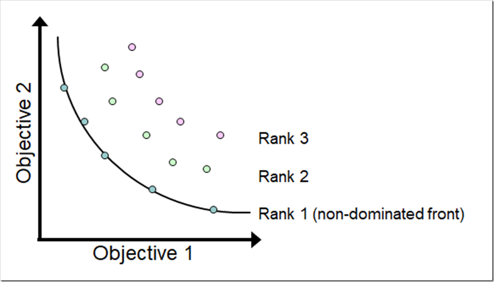

  

# Pyomo Optimization Problem Set, Spring 2022

- Collin Guidry

# Overview

This repository contains code and discussion related to multi-objective optimization problems using Pyomo and IPOPT solver. Specifically, it tackles two real-world cases:

1. Profit vs. Units Sold: A startup company wants to maximize its profit and the number of units sold through effective advertisement spending.
2. Hiland Appliance Stocking: Hiland has to decide the optimal number of TVs and Blu-ray disc players to stock under budget and storage constraints, aiming to maximize profit.

## Table of Contents

- [Question 1: Profit vs Units Sold](#question-1-profit-vs-units-sold)
  - [Part (a) Problem Formulation](#part-a-problem-formulation)
  - [Part (b) Determine extreme points](#part-b-determine-extreme-points)
  - [Part (c) Pareto-optimal points](#part-c-pareto-optimal-points)
  - [Part (d) Discussion](#part-d-discussion)
- [Question 2](#question-2)
  - [Part (a) Problem Formulation](#part-a-problem-formulation-1)
  - [Part (b) Pareto-optimal points](#part-b-pareto-optimal-points-1)

## Question 1: Profit vs Units Sold

A startup company needs to increase its sales of a product through advertisements. The company aims to find a balance between maximizing profit and maximizing the number of units sold.

### Part (a) Problem Formulation

1. **Decision Variables**: \( a = \) advertising investment in thousands of dollars.
2. **Objective Function**: Maximize \( f_1(a) = 890-3.8a+20\sqrt{a} \) and \( f_2(a) = -1.444a^2 + 7.6\sqrt{a}*a + 80\sqrt{a} + 322a +3560 \)
3. **Constraints**: \( a > 0 \)

The code implements this problem using Pyomo and solves it using the IPOPT solver.

### Part (b) Determine extreme points

The code first deactivates one objective and solves for the other. This provides the limits for each objective.

### Part (c) Pareto-optimal points

The code finds 10 Pareto-optimal points by varying the weights given to the objectives. A Pareto frontier is plotted using matplotlib.

### Part (d) Discussion

The company should repeat this weighed sum method, but **maximize sales before profit** to better understand the trade-offs between the objectives.

---

## Question 2

Hiland Appliance must determine how many TVs and Blu-Ray disc players to stock, considering budget, profit, and storage.

### Part (a) Problem Formulation

- **Decision Variables**: \( x_1 \) = Number of TVs, \( x_2 \) = Number of Blu-Ray disc players
- **Objective Function**: \( f_1 = 150x_1 + 50x_2 \) (Profit), \( f_2 = 3x_1 + x_2 \) (Storage)
- **Constraints**: \( 1000x_1 + 200x_2 \leq 60000 \), \( x_1, x_2 \geq 0 \)

### Part (b) Pareto-optimal points

The code first maximizes profit subject to constraints, then minimizes space while maintaining that level of profit. This is a form of lexicographic optimization, which is consistent with the company's priorities.

The Pareto optimal point will maximize the profit while minimizing the storage space, respecting the budget constraint.

## Installation and Dependencies

* Python 3.6+
* Pyomo
* IPOPT solver
* Matplotlib
* Pandas
* NumPy

## How to Run

1. Clone this repository.
2. Install all dependencies.
3. Open the notebook and run all cells.
